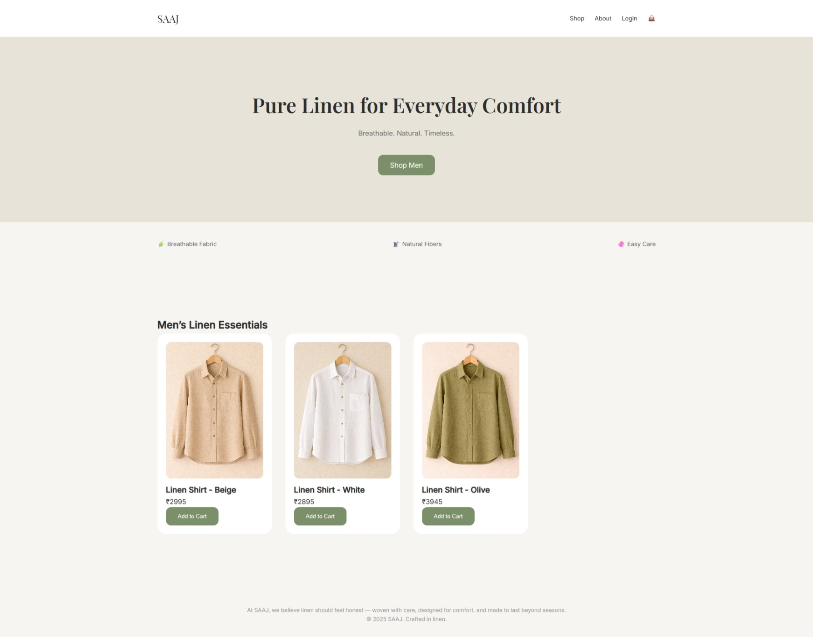
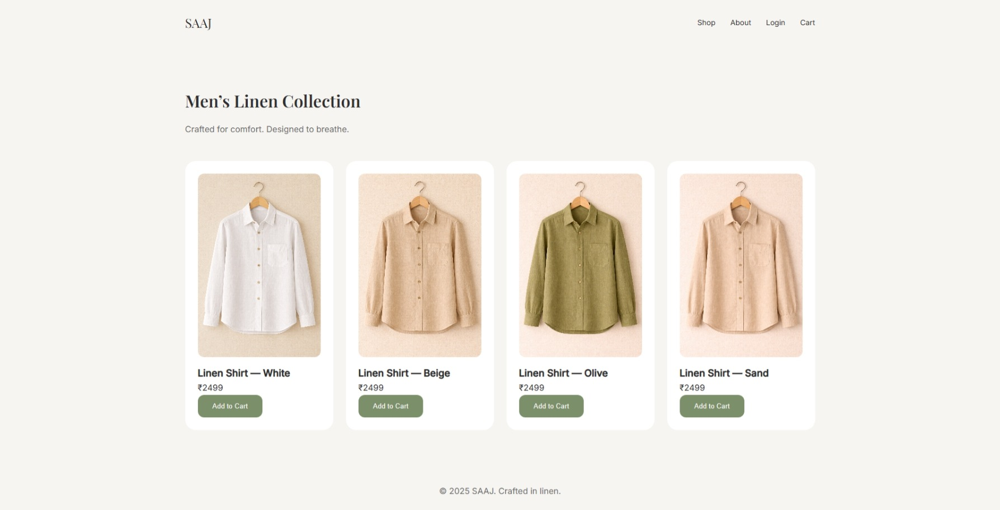
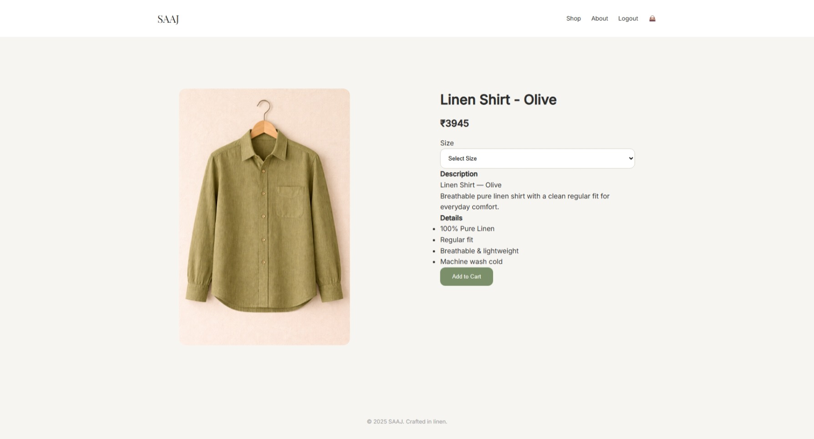
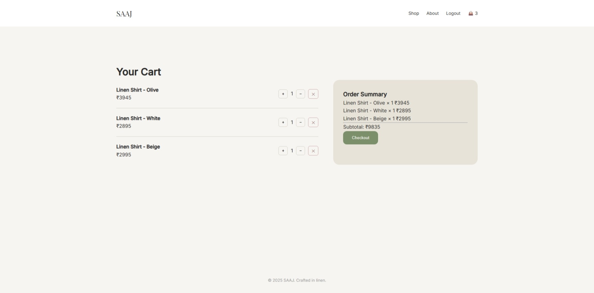
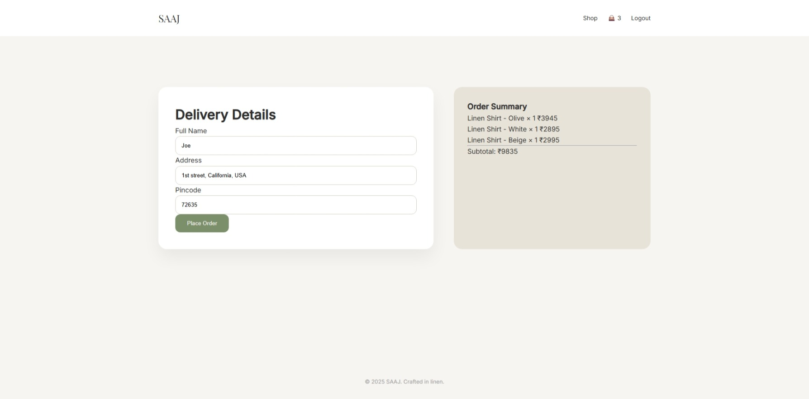
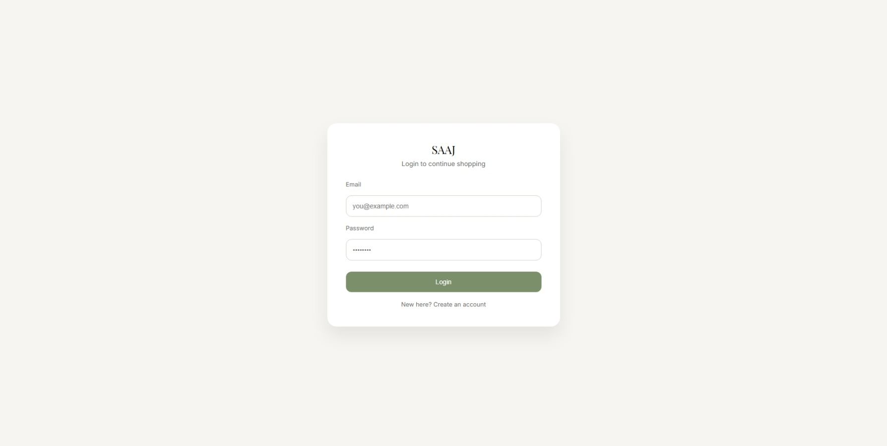
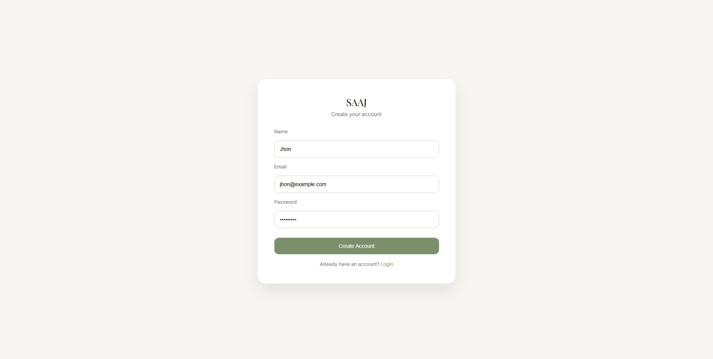

# 🧥 SAAJ — Premium Linen Clothing E-Commerce Website

**SAAJ** is a production-ready **frontend e-commerce website** built for a premium linen clothing brand.  
The project focuses on **clean UI/UX, real user flows, and scalable frontend architecture**, closely simulating how modern e-commerce platforms work.

It is built using **vanilla HTML, CSS, and JavaScript** — no frameworks — to demonstrate strong core frontend fundamentals.

---

## 🚀 Live Demo

👉 **Live Website:**  
https://saaj-store.vercel.app/

*(Hosted on Vercel — fast, stable, and free)*

---

## ✨ Key Features

### 🏠 Home Page
- Premium linen-inspired design
- Featured products loaded dynamically
- Clean typography and spacing
- Fully responsive layout

### 🛍️ Products Page
- All products rendered dynamically
- Product image, name, and price
- Click to view detailed product page

### 📄 Product Detail Page (PDP)
- URL-based routing (`product.html?id=1`)
- Product image, description, and price
- Add-to-cart functionality

### 🛒 Cart System
- Add / remove products
- Increase / decrease quantity
- Real-time price calculation
- Persistent cart using `localStorage`
- Premium cart UI with order summary

### 🔐 Authentication (Frontend)
- Login & Signup pages
- Isolated CSS (no global conflicts)
- Prevent login/signup when already logged in
- Login required for cart & checkout
- Redirect back after login (real-world UX)

### 💳 Checkout Flow
- Login-protected checkout
- Mandatory delivery details validation
- Order summary breakdown
- Prevent checkout with empty cart

### ✅ Order Success
- Order confirmation page
- Cart cleared after successful order

---

## 🎨 UI / UX Highlights

- Linen-inspired neutral color palette
- Premium spacing & typography
- Sticky footer on all pages
- Fully responsive (desktop, tablet, mobile)
- Clean separation of concerns (layout, logic, state)

---

## 🛠️ Tech Stack

- **HTML5**
- **CSS3** (Custom design system, no frameworks)
- **JavaScript (ES6+)**
- **Browser LocalStorage** (Auth & cart state)
- **Vercel** (Deployment)
- **GitHub Releases** (Versioning)

---

## 🏗️ Project Architecture

SAAJ follows a **Modular Client-Side Architecture**. Since it operates without a backend, the logic is decoupled into a presentation layer, a JS controller layer, and a persistent LocalStorage state.

### 🔁 Application Flow
The following flowchart illustrates how user interactions trigger logic that updates the global state and reflects back on the UI.


```mermaid
graph TD
    %% User Flow
    User((User)) -->|Interacts| UI[Presentation Layer: HTML/CSS]
    
    subgraph Browser_Runtime [Browser Runtime]
        UI -->|Events| JS[Logic Layer: JS Modules]
        JS -->|CRUD Ops| LS[(LocalStorage: State)]
        LS -->|Data Sync| JS
        JS -->|DOM Updates| UI
    end

    %% State Logic
    subgraph State_Management [Data Persistence]
        LS --- CartItems["'cart': [ ]"]
        LS --- UserAuth["'isLoggedIn': bool"]
        LS --- UserProfile["'user': { }"]
    end

    %% Flow Examples
    UI -.->|Add to Cart| JS
    JS -.->|Set Item| LS
    LS -.->|Update Badge| UI

---

## 🖼️ Screenshots

Screenshots of the application are available in the `/screenshots` folder:

## 🖼️ Screenshots

### 🏠 Home Page


### 🛍️ Products Page


### 📄 Product Detail Page


### 🛒 Cart Page


### 💳 Checkout Page


### 🔐 Login Page


### 📝 Signup Page


---

## ⚙️ How to Run Locally

> ⚠️ Use a local server (not `file://`)

### Option 1: VS Code Live Server (Recommended)
1. Install **Live Server** extension
2. Right-click `index.html`
3. Click **Open with Live Server**

### Option 2: Using Python
```bash
cd project-folder
python -m http.server 5500
http://localhost:5500  

---

👤 Author
Harsh Parit
Frontend Developer | Full Stack Developer
📧 Email: harshparit@gmail.com
🔗 GitHub: https://github.com/harsh-parit
🔗 LinkedIn: https://www.linkedin.com/in/harsh-parit/